# Markdown Feature Showcase

This file demonstrates the main Markdown features in one place, including Mermaid diagrams.

---

## Headings

# Heading 1
## Heading 2
### Heading 3
#### Heading 4
##### Heading 5
###### Heading 6

---

## Text Formatting

Normal text

**Bold text**

*Italic text*

***Bold and italic text***

~~Strikethrough~~

`Inline code`

<mark>Highlighted text using HTML</mark>

<u>Underlined text using HTML</u>

H<sub>2</sub>O

X<sup>2</sup>

Escaped characters:

\*  
\_  
\#  
\`  
\[  
\]

---

## Paragraphs

This is the first paragraph.

This is the second paragraph.

This line ends with two spaces.  
This appears on a new line.

---

## Blockquotes

> This is a blockquote.

> This is a blockquote
>
> with multiple paragraphs.

> Level 1
>> Level 2
>>> Level 3

---

## Unordered Lists

- Item 1
- Item 2
  - Nested item 2.1
  - Nested item 2.2
    - Nested item 2.2.1
- Item 3

Alternative markers:

* Asterisk item
+ Plus item
- Dash item

---

## Ordered Lists

1. First
2. Second
3. Third

Nested:

1. Frontend
   1. React
   2. Next.js
2. Backend
   1. Node.js
   2. PostgreSQL

Auto numbering:

1. First
1. Second
1. Third

---

## Task Lists

- [x] Create project
- [x] Add Markdown
- [x] Add Mermaid
- [ ] Deploy project
- [ ] Write documentation

---

## Links

[OpenAI](https://openai.com)

[GitHub](https://github.com)

<https://example.com>

<hello@example.com>

Link with title:

[Example](https://example.com "Example Website")

Reference link:

[GitHub][github]

[github]: https://github.com

---

## Images


Clickable image:

[](https://example.com)

---

## Horizontal Rules

---

***

___

---

## Inline Code

Use `pnpm install` to install dependencies.

Use `pnpm dev` to start development.

Example:

`const hello = "world";`

---

## Code Blocks

Plain text:

```text
Hello world
This is a code block.
````

JavaScript:

```js
function greet(name) {
  return `Hello, ${name}!`;
}

console.log(greet("Jay"));
```

TypeScript:

```ts
interface User {
  id: string;
  name: string;
}

const user: User = {
  id: "1",
  name: "Jay",
};
```

React / TSX:

```tsx
export function Button() {
  return (
    <button className="rounded-md px-4 py-2">
      Click me
    </button>
  );
}
```

CSS:

```css
.button {
  display: inline-flex;
  align-items: center;
  border-radius: 8px;
}
```

Bash:

```bash
pnpm install
pnpm dev
```

JSON:

```json
{
  "name": "markdown-showcase",
  "version": "1.0.0"
}
```

YAML:

```yaml
name: Example

features:
  - markdown
  - mermaid
```

Python:

```python
def greet(name):
    return f"Hello, {name}"
```

SQL:

```sql
SELECT id, name
FROM users
WHERE active = true;
```

Diff:

```diff
- const enabled = false;
+ const enabled = true;
```

HTTP:

```http
POST /api/users HTTP/1.1
Content-Type: application/json

{
  "name": "Jay"
}
```

---

## Tables

| Feature | Supported | Example      |
| ------- | --------: | ------------ |
| Bold    |       Yes | `**text**`   |
| Italic  |       Yes | `*text*`     |
| Code    |       Yes | `` `code` `` |
| Mermaid |   Depends | `mermaid`    |

Alignment:

| Left | Center | Right |
| :--- | :----: | ----: |
| A    |    B   |     C |
| 1    |    2   |     3 |

---

## Mermaid Flowchart

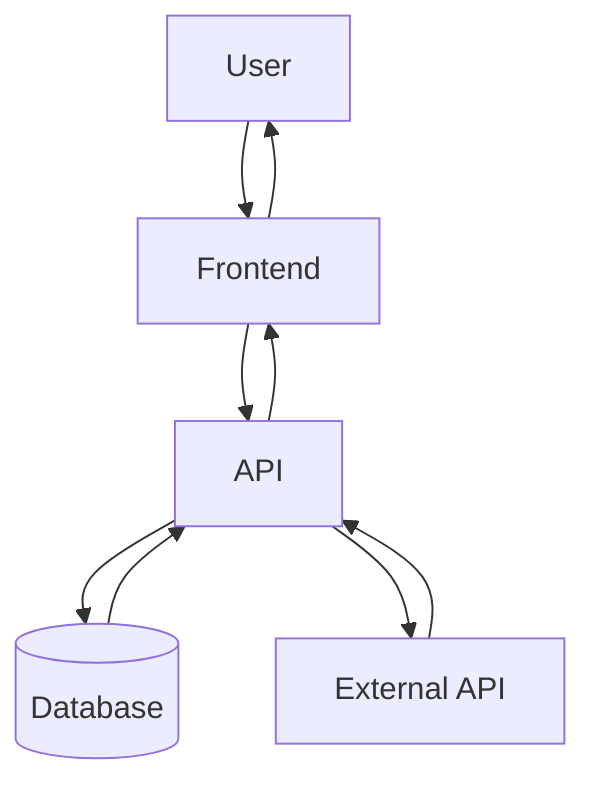

---

## Mermaid Flowchart LR

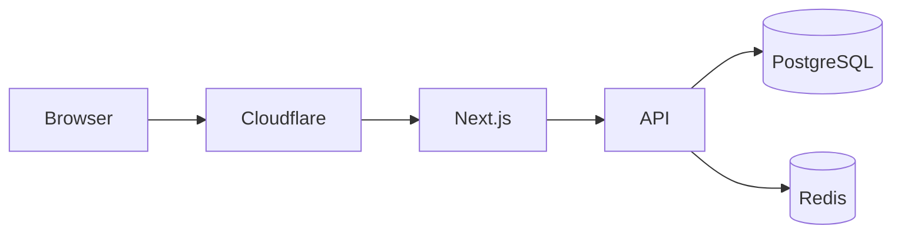

---

## Mermaid Sequence Diagram

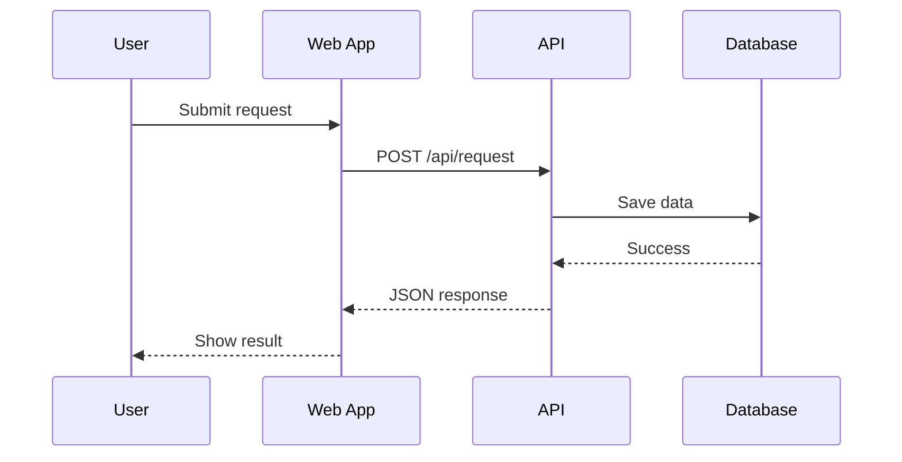

---

## Mermaid Class Diagram

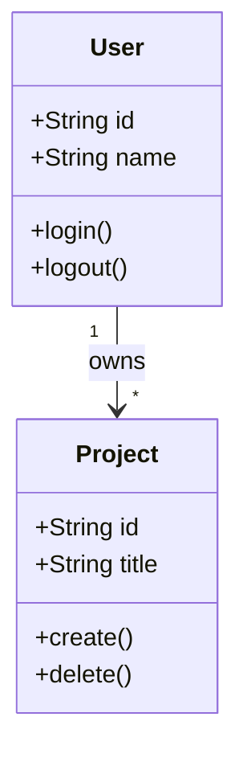

---

## Mermaid State Diagram

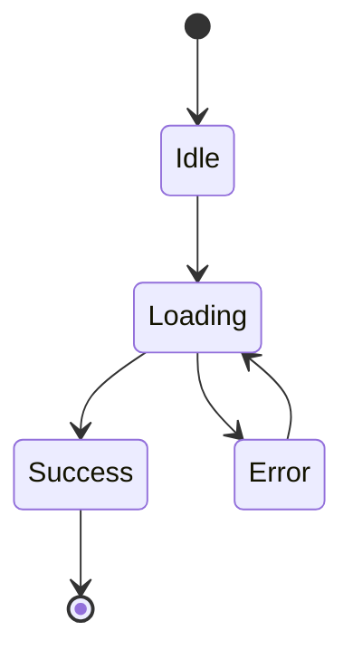

---

## Mermaid ER Diagram

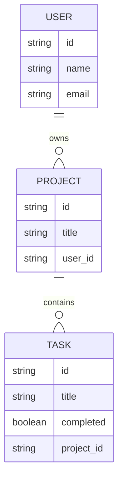

---

## Mermaid Gantt Chart

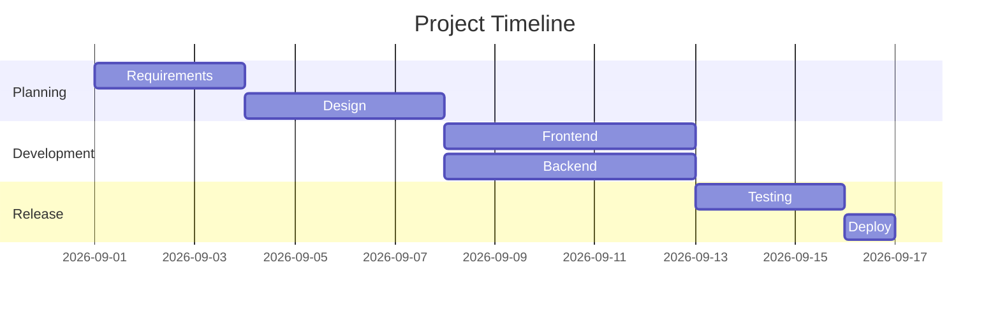

---

## Mermaid Pie Chart

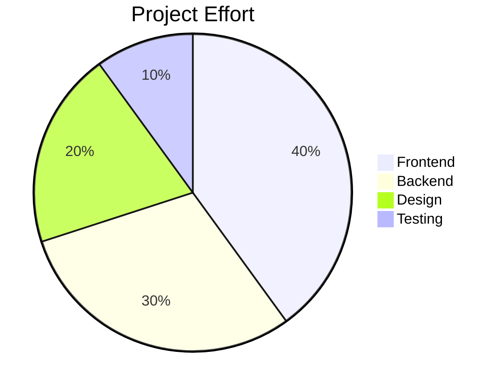

---

## Mermaid Git Graph

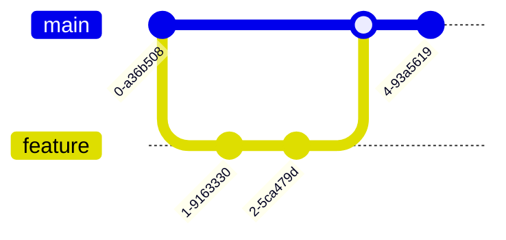

---

## Mermaid Mindmap

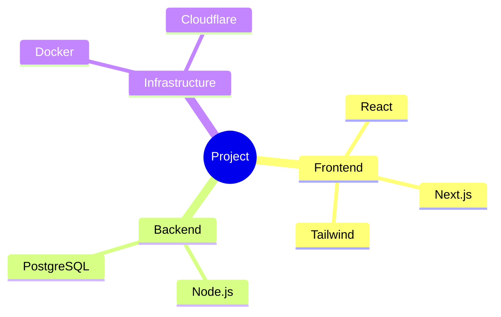

---

## Mermaid Timeline

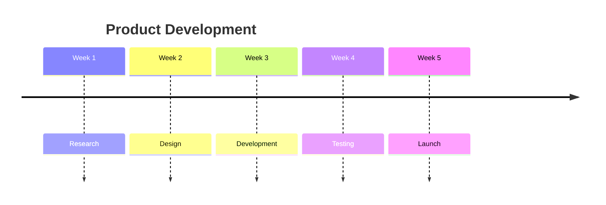

---

## Mermaid User Journey

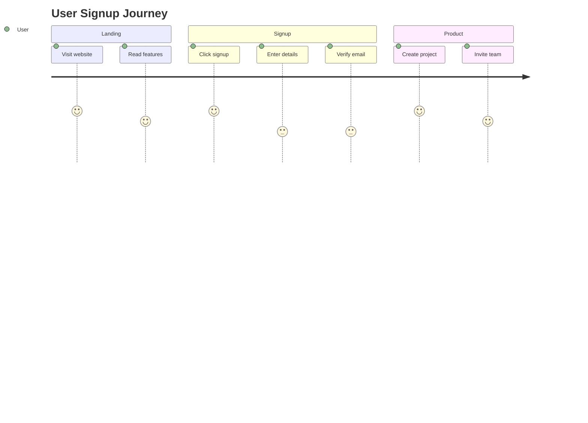

---

## Mermaid Quadrant Chart

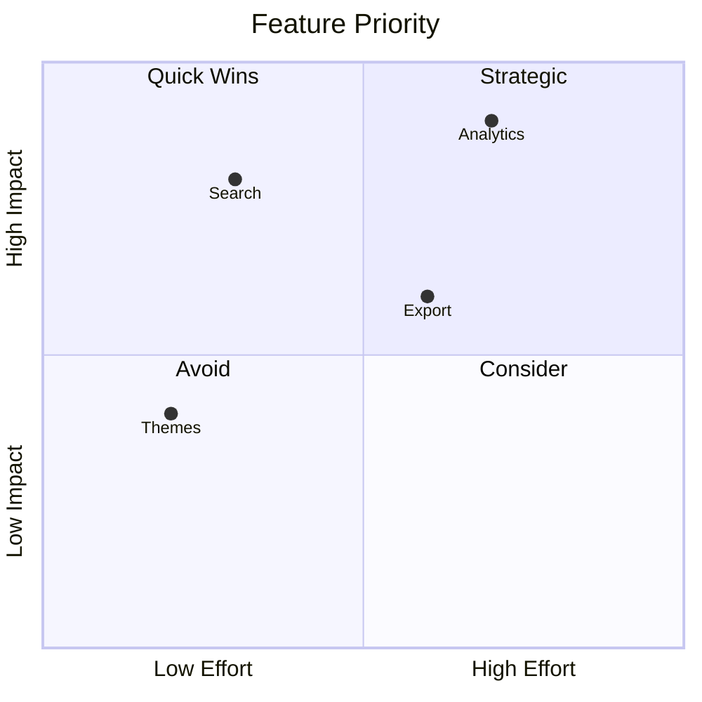

---

## Mermaid Requirement Diagram

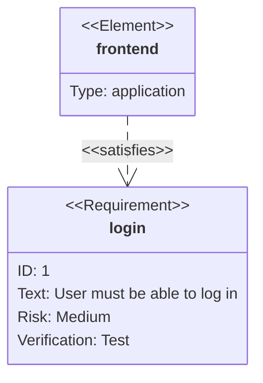

---

## Mermaid XY Chart

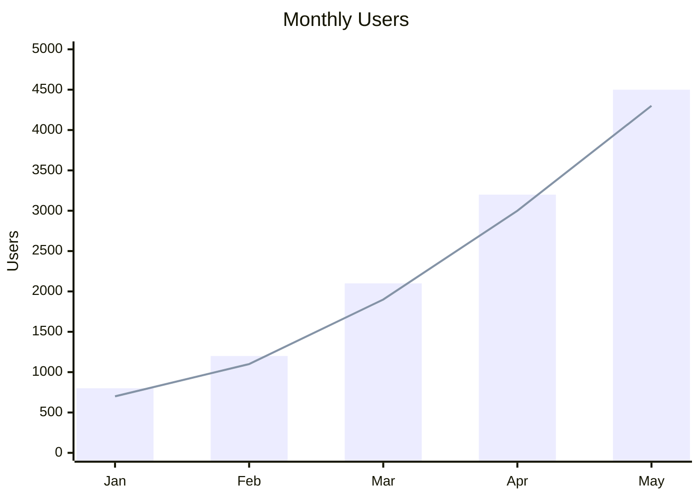

---

## Mermaid Sankey Diagram

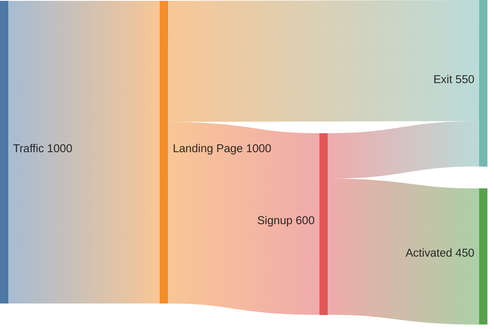

---

## Footnotes

This sentence has a footnote.[^1]

This one also has a footnote.[^docs]

[^1]: This is the first footnote.

[^docs]: Footnote support depends on the Markdown renderer.

---

## Definition Lists

Term 1
: Definition for term 1.

Term 2
: Definition for term 2.

---

## Collapsible Details

<details>
<summary>Click to expand</summary>

Hidden content goes here.

* Item one
* Item two
* Item three

```js
console.log("Inside details");
```

</details>

---

## Keyboard Keys

Press <kbd>Command</kbd> + <kbd>Shift</kbd> + <kbd>P</kbd>.

Press <kbd>Command</kbd> + <kbd>K</kbd>.

---

## HTML Inside Markdown

<div>
  <strong>HTML can be used inside Markdown.</strong>
</div>

<br />

<table>
  <tr>
    <th>Name</th>
    <th>Role</th>
  </tr>
  <tr>
    <td>Jay</td>
    <td>Engineer</td>
  </tr>
</table>

---

## HTML Comments

<!-- This is a hidden comment -->

Visible content.

<!--
Multi-line
comment
-->

---

## Math

Inline math:

$E = mc^2$

Block math:

$$
E = mc^2
$$

Quadratic example:

$$
f(x) = x^2 + 2x + 1
$$

Fraction:

$$
\frac{a}{b}
$$

Square root:

$$
\sqrt{x}
$$

---

## Emoji Shortcodes

Some renderers support:

`:rocket:`

`:white_check_mark:`

`:fire:`

`:warning:`

---

## Mentions

Platform-dependent:

`@username`

Example:

@octocat

---

## Issue and PR References

Platform-dependent:

`#123`

Example:

Fixes #123

Closes #456

---

## Automatic URLs

[https://github.com](https://github.com)

[https://openai.com](https://openai.com)

[https://example.com](https://example.com)

---

## Nested Code in Lists

1. Install dependencies

   ```bash
   pnpm install
   ```

2. Start development server

   ```bash
   pnpm dev
   ```

3. Build project

   ```bash
   pnpm build
   ```

---

## Escaping Markdown

# Not a heading

* Not italic

** Not bold

` Not inline code

$$Not a link

---

## Raw URLs

<https://github.com>

<https://openai.com>

<mailto:hello@example.com>

---

## Reference Links

Read the [Markdown Guide][markdown].

Visit [GitHub][repo].

[markdown]: https://www.markdownguide.org/
[repo]: https://github.com/

---

## Status Table

| Task | Status |
|---|---|
| Design | Done |
| Development | Done |
| Testing | In progress |
| Deployment | Pending |

---

## File Tree

```text
project/
├── app/
│   ├── page.tsx
│   └── layout.tsx
├── components/
│   ├── button.tsx
│   └── card.tsx
├── lib/
│   └── utils.ts
├── public/
├── package.json
└── README.md
```

---

## API Request

```http
POST /api/users HTTP/1.1
Host: example.com
Content-Type: application/json

{
  "name": "Jay",
  "email": "jay@example.com"
}
```

---

## API Response

```json
{
  "id": "usr_123",
  "name": "Jay",
  "email": "jay@example.com"
}
```

---

## YAML Front Matter

Front matter normally appears at the very top of a Markdown file.

```yaml
---
title: Markdown Showcase
description: Complete Markdown feature example
author: Jay
date: 2026-09-06
tags:
  - markdown
  - documentation
  - mermaid
---
```

---

## GitHub Alerts

> [!NOTE]
> Useful information that users should know.

> [!TIP]
> Helpful advice.

> [!IMPORTANT]
> Important information.

> [!WARNING]
> Something may cause problems.

> [!CAUTION]
> Be careful before continuing.

---

## Heading Anchor Links

[Go to Mermaid Flowchart](#mermaid-flowchart)

[Go to Tables](#tables)

[Go to-code-blocks](#code-blocks)

---

## Nested Blockquote and List

> Important information:
>
> - First point
> - Second point
> - Third point

---

## Blockquote With Code

> Run:
>
> ```bash
> pnpm dev
> ```

---

## Nested Task Lists

- [x] Frontend
  - [x] Layout
  - [x] Components
  - [ ] Animations
- [ ] Backend
  - [x] API
  - [ ] Queue
  - [ ] Background jobs

---

## Complex Table

| Name | Type | Default | Required |
|---|---|---|---|
| `name` | `string` | `-` | Yes |
| `enabled` | `boolean` | `true` | No |
| `count` | `number` | `0` | No |

---

## Code With Filename Pattern

`app/page.tsx`

```tsx
export default function Page() {
  return <main>Hello world</main>;
}
```

`lib/db.ts`

```ts
export const db = {
  connected: true,
};
```

---

## Markdown Checklist Example

### Development

- [x] Project setup
- [x] Authentication
- [x] Dashboard
- [ ] Billing
- [ ] Analytics
- [ ] Production deploy

### Design

- [x] Typography
- [x] Colors
- [ ] Dark mode
- [ ] Mobile polish

---

## Markdown Documentation Example

### Button

A reusable button component.

#### Props

| Prop | Type | Description |
|---|---|---|
| `variant` | `string` | Button style |
| `size` | `string` | Button size |
| `disabled` | `boolean` | Disable button |

#### Usage

```tsx
<Button variant="primary">
  Continue
</Button>
```

---

## Markdown API Documentation

### `GET /api/users`

Returns all users.

#### Response

```json
{
  "users": [
    {
      "id": "1",
      "name": "Jay"
    }
  ]
}
```

### `POST /api/users`

Creates a user.

#### Request

```json
{
  "name": "Jay"
}
```

#### Response

```json
{
  "id": "1",
  "name": "Jay"
}
```

---

## Mermaid Authentication Flow

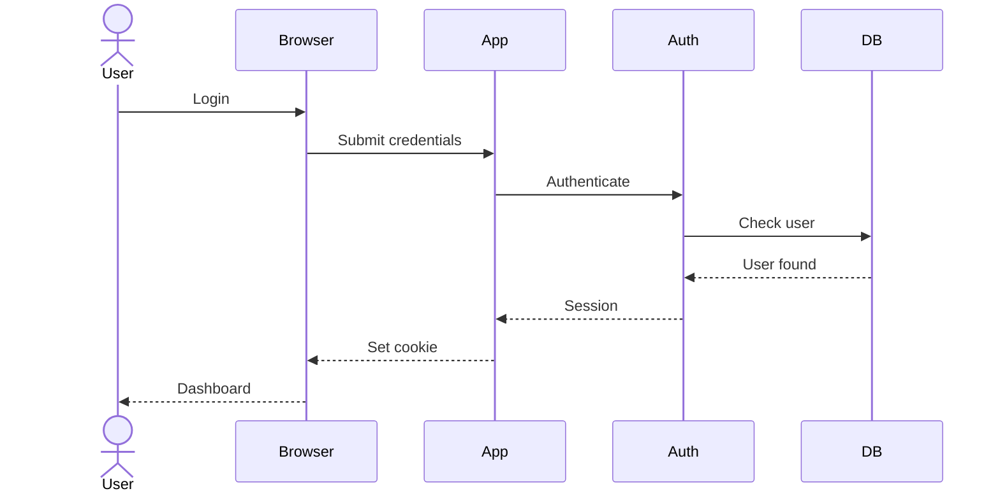

---

## Mermaid Agent Flow

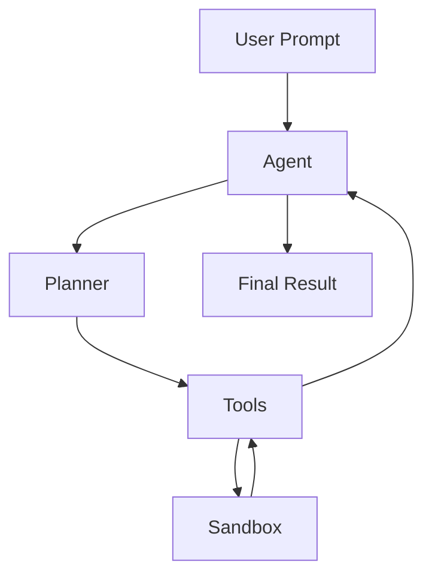

---

## Mermaid Queue Flow

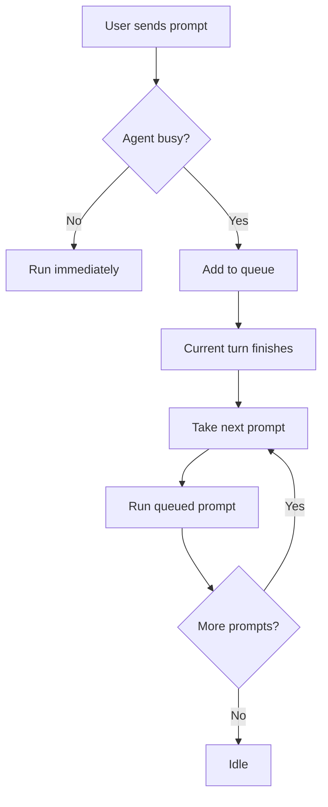

---

## Mermaid Deployment Flow

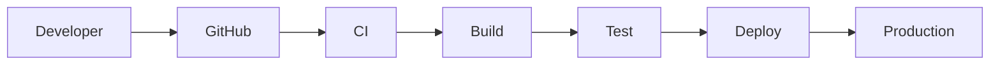

---

## Mermaid Database Relationships

```mermaid
erDiagram
    USER ||--o{ SESSION : creates
    USER ||--o{ PROJECT : owns
    PROJECT ||--o{ SESSION : contains
    SESSION ||--o{ MESSAGE : contains
    SESSION ||--o{ TOOL_CALL : executes

    USER {
        uuid id
        string email
    }

    PROJECT {
        uuid id
        uuid user_id
        string name
    }

    SESSION {
        uuid id
        uuid user_id
        uuid project_id
    }

    MESSAGE {
        uuid id
        uuid session_id
        string role
        text content
    }

    TOOL_CALL {
        uuid id
        uuid session_id
        string tool
        string status
    }
```

---

## Markdown Support Notes

Features supported by almost every Markdown renderer:

- Headings
- Paragraphs
- Bold
- Italic
- Lists
- Links
- Images
- Blockquotes
- Inline code
- Code blocks
- Horizontal rules

GitHub Flavored Markdown usually supports:

- Tables
- Task lists
- Strikethrough
- Automatic links
- HTML
- Alerts

Renderer-dependent features:

- Mermaid
- Math
- Footnotes
- Definition lists
- Emoji shortcodes
- Front matter
- `<details>`
- Advanced Mermaid diagrams
- Syntax highlighting

---

## End

This file can be used as:

- Markdown renderer test
- Markdown syntax reference
- Mermaid test file
- Documentation example
- README example
- MD/MDX compatibility test
